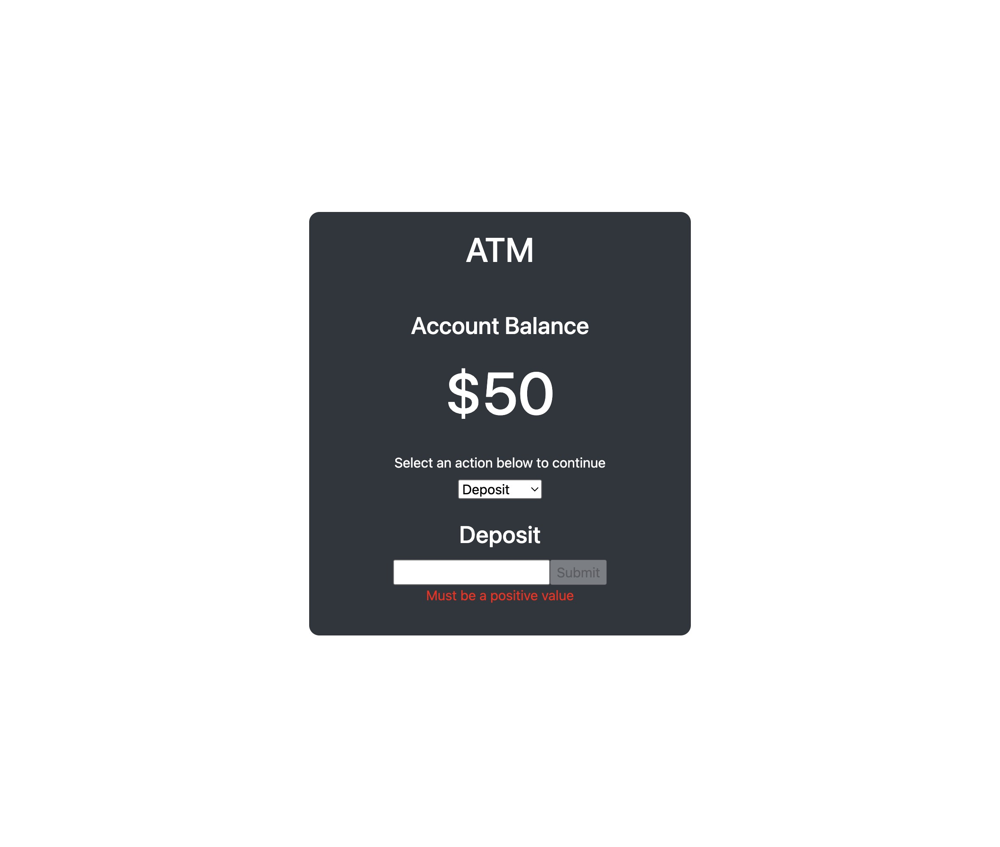

# ATM Example

## Description

An ATM that uses state to store a bank account balance with the ability to deposit and withdraw funds via cash back.

Additional implementations: error messages describing input value errors, style and format changes

Built using React to practice using the state of parent components in a CRUD model.

## Installation

Simply download the folder to your local machine, navigate to the root folder using your terminal, then run 'npm install' and 'npm start'.

The program should then open on your browser and run from there!

## Future Improvements

This ATM will allow the user to select an account to deposit to or withdraw from.

## MIT License

Permission is hereby granted, free of charge, to any person obtaining a copy
of this software and associated documentation files (the "Software"), to deal
in the Software without restriction, including without limitation the rights
to use, copy, modify, merge, publish, distribute, sublicense, and/or sell
copies of the Software
